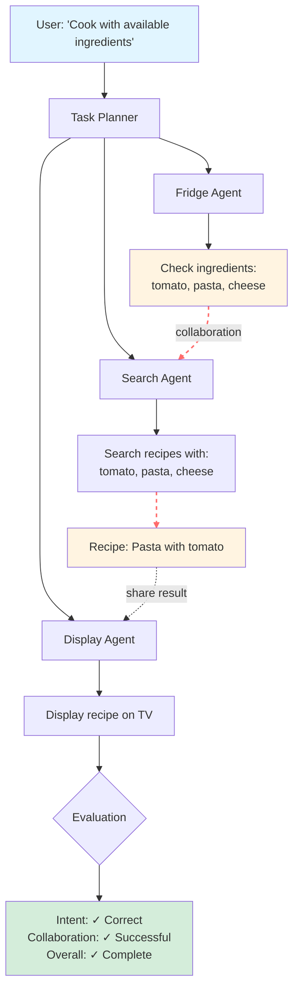

# Study
建立知识体系

```mermaid
flowchart TD
    A["User: 'Cook with available ingredients'"] --> B[Task Planner]
    B --> C[Search Agent]
    B --> D[Fridge Agent]
    B --> E[Display Agent]
    
    D --> F["Check ingredients:<br/>tomato, pasta, cheese"]
    F -.->|collaboration| C
    C --> G["Search recipes with:<br/>tomato, pasta, cheese"]
    G --> H["Recipe: Pasta with tomato"]
    H -.->|share result| E
    E --> I["Display recipe on TV"]
    
    I --> J{Evaluation}
    J --> K["Intent: ✓ Correct<br/>Collaboration: ✓ Successful<br/>Overall: ✓ Complete"]
    
    style A fill:#e1f5ff
    style F fill:#fff4e1
    style H fill:#fff4e1
    style K fill:#d4edda
    
    linkStyle 5,7 stroke:#ff6b6b,stroke-width:2px,stroke-dasharray: 5 5
```
