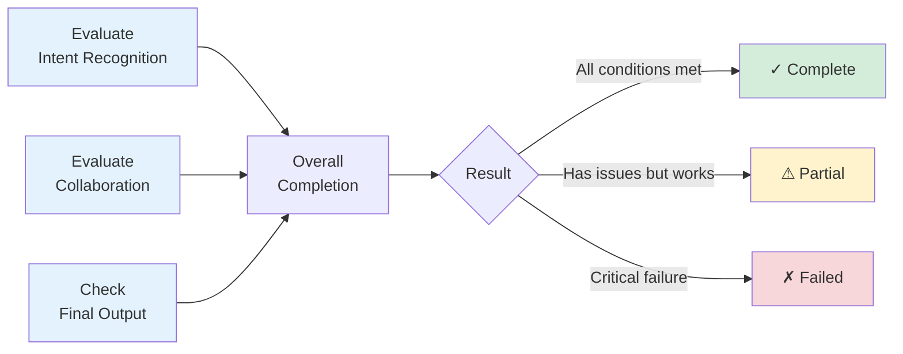
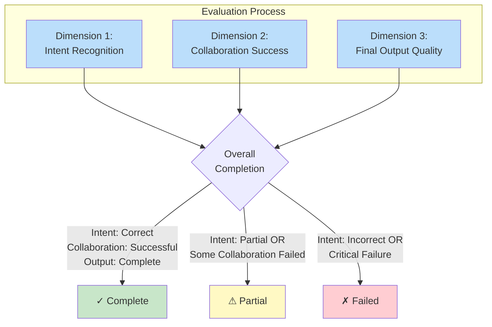
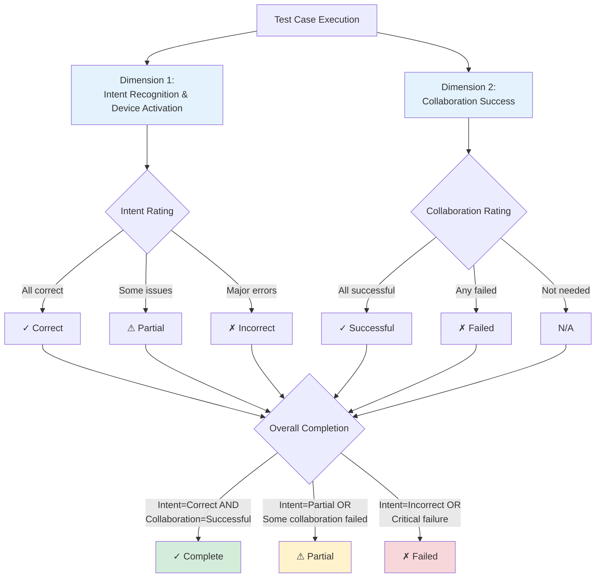

# Study
建立知识体系

```mermaid
flowchart LR
    A[Evaluate<br/>Intent Recognition] --> D[Overall<br/>Completion]
    B[Evaluate<br/>Collaboration] --> D
    C[Check<br/>Final Output] --> D
    
    D --> E{Result}
    E -->|All conditions met| F[✓ Complete]
    E -->|Has issues but works| G[⚠ Partial]
    E -->|Critical failure| H[✗ Failed]
    
    style A fill:#e3f2fd
    style B fill:#e3f2fd
    style C fill:#e3f2fd
    style F fill:#d4edda
    style G fill:#fff3cd
    style H fill:#f8d7da
```

```mermaid
graph TD
    subgraph Evaluation["Evaluation Process"]
        A["Dimension 1:<br/>Intent Recognition"]
        B["Dimension 2:<br/>Collaboration Success"]
        C["Dimension 3:<br/>Final Output Quality"]
    end
    
    A --> D{Overall<br/>Completion}
    B --> D
    C --> D
    
    D -->|"Intent: Correct<br/>Collaboration: Successful<br/>Output: Complete"| E[✓ Complete]
    D -->|"Intent: Partial OR<br/>Some Collaboration Failed"| F[⚠ Partial]
    D -->|"Intent: Incorrect OR<br/>Critical Failure"| G[✗ Failed]
    
    style A fill:#bbdefb
    style B fill:#bbdefb
    style C fill:#bbdefb
    style E fill:#c8e6c9
    style F fill:#fff9c4
    style G fill:#ffcdd2
```

```mermaid
flowchart TD
    A[Test Case Execution] --> B[Dimension 1:<br/>Intent Recognition & Device Activation]
    A --> C[Dimension 2:<br/>Collaboration Success]
    
    B --> D{Intent Rating}
    D -->|All correct| E[✓ Correct]
    D -->|Some issues| F[⚠ Partial]
    D -->|Major errors| G[✗ Incorrect]
    
    C --> H{Collaboration Rating}
    H -->|All successful| I[✓ Successful]
    H -->|Any failed| J[✗ Failed]
    H -->|Not needed| K[N/A]
    
    E --> L{Overall Completion}
    F --> L
    G --> L
    I --> L
    J --> L
    K --> L
    
    L -->|Intent=Correct AND<br/>Collaboration=Successful| M[✓ Complete]
    L -->|Intent=Partial OR<br/>Some collaboration failed| N[⚠ Partial]
    L -->|Intent=Incorrect OR<br/>Critical failure| O[✗ Failed]
    
    style B fill:#e3f2fd
    style C fill:#e3f2fd
    style M fill:#d4edda
    style N fill:#fff3cd
    style O fill:#f8d7da
```
