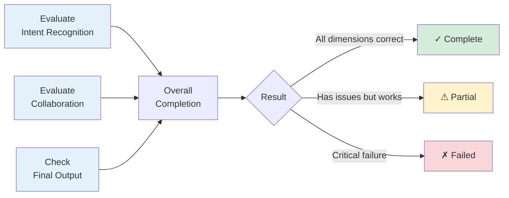

# Study
建立知识体系

```mermaid
flowchart LR
    A[Evaluate<br/>Intent Recognition] --> D[Overall<br/>Completion]
    B[Evaluate<br/>Collaboration] --> D
    C[Check<br/>Final Output] --> D
    
    D --> E{Result}
    E -->|All dimensions correct| F[✓ Complete]
    E -->|Has issues but works| G[⚠ Partial]
    E -->|Critical failure| H[✗ Failed]
    
    style A fill:#e3f2fd
    style B fill:#e3f2fd
    style C fill:#e3f2fd
    style F fill:#d4edda
    style G fill:#fff3cd
    style H fill:#f8d7da
```
